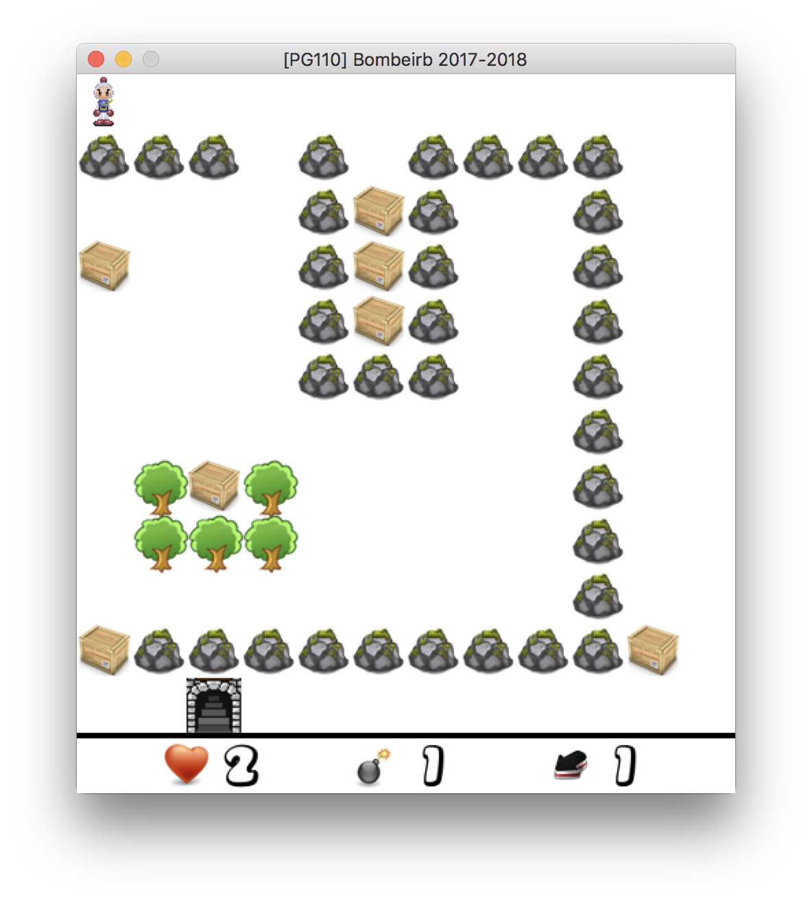

# Bomberman

Mini "bomberman" game in 2D, made in C with the SDL library. The goal of the game is to reach the princess surrounded by a bunch of evil monsters in the last level. The monsters will be more terrifying the closer you get to the princess.

Installation
------------
To install the game, you have to clone the repo and compile the files :

    $ git clone https://github.com/THoulier/Bombeirb.git
    $ cd sources
    $ make
    
To launch the game, execute the next command line in a terminal :

    $ ./bin/bombeirb

Gameplay
------------
You control "bomberman" who has 3 main capacities :
- moves
- put down a "bomb" which is going to explode 4 seconds later
- moving from a map to another map

Save your current game :
At any time, you can save your game to resume it later. To launch a saved game, you must launch the game with the next command line :

    $ ./bin/bombeirb save

Commands list :
- keyboard arrows : player moves
- space : put down a bomb
- P : pause the game
- S : save your game
- O : open a door with a key and move to another map
- Q : quit the game

Screenshots
------------

